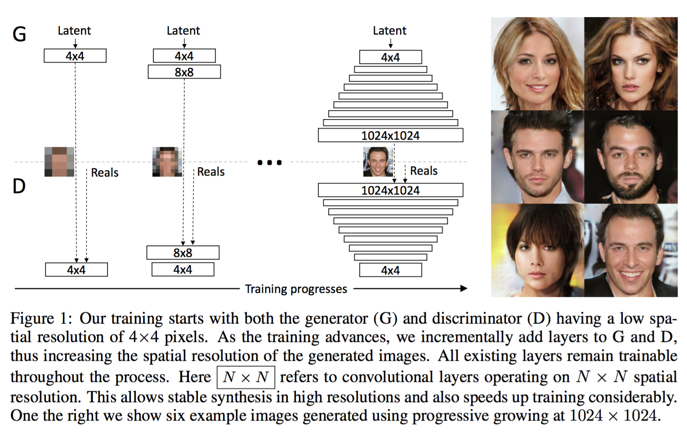
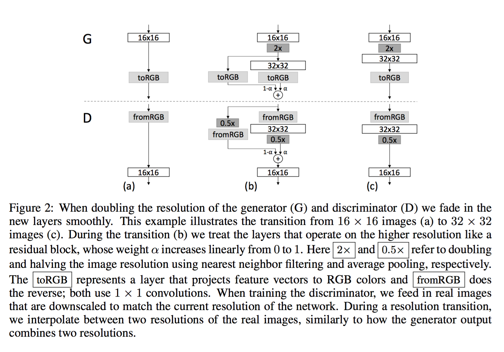

# Progressive Growing of GANs 中文简要翻译

原文：[Progressive Growing of GANs for Improved Quality, Stability, and Variation](http://research.nvidia.com/publication/2017-10_Progressive-Growing-of)

翻译：闫坤、尹一航、王佳琪

## 摘要

我们描述了一种训练对抗生成网络的新方法。其关键在于逐步扩展生成器和判别器：从低分辨率出发，我们在训练的过程中不断加入新的层使得模型的细节更清晰。这种方法同时提升了训练速度和稳定性，使得我们可以生成之前从未出现过的高质量图片。比如1024*1024的CelebA图片。我们同时提出了一种简单方法来提升生成图片的多样性，并且在无监督的CIFAR10数据集上达到了8.80的 inception score。此外，我们描述了几个能够抑制生成器和判别器之间不正当竞争的实现细节。最后，我们为评估GAN模型提出了一种新的标准，同时考虑了图片质量和多样性。作为一个额外贡献，我们建立了一个更高质量的CelebA数据集。

## 1 引言


目前的图像生成方法

```
Auto Regressive Models: 如PixelCNN， 产生高质量的图像，但是运行效率低，没有隐式表达（直接建立像素之间的条件概率模型）。
VAEs (variational autoencoders): 容易训练但是会产生模糊的结果。
GANs (Generative adversal networkdxxx): 清晰地图像（低分辨率），多样性存在局限，训练过程不稳定。
杂交方法：结合三者的有点，但在图像质量上落后于GANs。
```

通常意义上讲，GANs包含两部分，生成器(Genator)和判别器(Discriminator)。

生成器基于隐式编码产生样例，这些样例应该与训练集有相同的分布，由于这个分布对于设计者而言是不可见的，所以用一个判别器来对生成样本和训练集的分布一致性做评估。由于网络是可导的，我们可以用梯度下降来优化两个部分。

一般来说，生成器是主要的关注目标，判别器是一个与之适应的损失函数，一旦生成器训练完毕，判别器就不在使用了。

#### 这一构想有3个潜在的问题

1、当训练分布和生成分布没有实质性的重叠，梯度的方向在某种程度上是随机的（比如过于容易区分）

最初JS散度被用来度量分布之间的距离：

$$
JS(P_1||P_2)=\frac{1}{2}KL(P_1||\frac{P_1+P_2}{2})+\frac{1}{2}KL(P_2||\frac{P_1+P_2}{2})
$$
最近构想有了改进，提出了一些列更稳定的其他选择，其中包括：

```
least squares (Mao et al., 2016b)
absolute deviation with margin (Zhao et al., 2017)
Wasserstein distance (Arjovsky et al., 2017; Gulrajaniet al., 2017). 
```


我们的工作正交于这些当下的探讨，主要使用了improved wasserstein loss，但也是用least squares做了一些实验。

2、生成高分辨率的图像极为困难

由于高分辨率使得区分生成样本和训练样本变得容易，这彻底放大了梯度问题。

高分辨率也使得使用小的batch-size成为了必须，因为在训练的稳定度上不得不妥协，我们的关键想法是逐渐的构建生成器和判别器，由简单的低分辨率图像开始，逐渐添加新层并引入高分辨率的细节，这极大地加速了训练过程，并提高了稳定性。我们将在第二部分进行讨论。

3、GAN构想没有显式地要求最终得到的生成模型完整地表示全部训练数据的分布，传统观念中，图像质量和多样性之间存在着一个折中（trade-off），这个观念近来受到了质疑。多样性的保留程度在当前有很高的关注度，各种各样的度量多样性的方法被提出，其中包括：

```
inception score (Salimans et al., 2016) 
multi-scale structural similarity (MS-SSIM) (Odena et al., 2017; Wang et al., 2003),birthday paradox (Arora & Zhang, 2017)
explicit tests for the number of discrete modes discovered (Metz et al., 2016). 
```

我们提升多样性的方法将在setion3进行描述，同时我们还在section5中提出了一种衡量质量和多样性的方法。

4.1节讨论了对网络初始化的一种精妙的修改，使得各层的学习速度更为平衡，更进一步的，我们观察到一直以来折磨GANs的mode collapses总是会很快的发生（经过十几个 minibatches）

注：mode collapses可简单理解为生成器局限于训练数据中的特定几个mode。


这通常开始于overshooted的判别器产生了夸张的梯度，使得两个网络中的信号量级逐步升高，形成不健康的竞争。

我们提出了一种机制使得生成器参与这个过程，克服了这个问题。

我们使用celebA, LSUN, CIFAR10 数据集测试了我们的工作成果。在CIFAR10 上我们达到了目前最高的inception score，由于CIFAR10的分辨率过低，我们还创建了一个高清版本的celeba是的最高1024*1024的分辨率实验成为可能。

## 2 渐进式增长的 GANs	

我们的贡献是一种训练GANs的方法，从低分辨率图像开始，之后逐渐提高分辨率，并向网络中添加心，如图1所示，这种递增的特性是训练首先发现图片分布的大尺度结构特征，之后将注意力转移到提升细节上，而不是同时学习所有的特征。



我们使用互为镜像的生成和判别网络，并总是同步地增大，在训练过程中，所有在两个网络中已存在的层仍然保持可训练的状态，当新层添加到网络中时，我们将它平滑的淡入，像图2中的那样，这样避免了已经训练好的低分辨率层带来突然的震荡，附录A详细描述了生成器和判别器的结构，以及他们的训练参数。



我们观察到渐进式的训练有几个优点，首先，由于有更少的类别信息和modes，生成小图像实质上变得更稳定，通过一点一点地提升分辨率，我们在不断地提出了一个个相较于直接得到，从映射向量到1024*1024分辨率的图像的映射而言简单得多的问题，这个方法在概念上和XX的工作很想，在实践中，这充分的稳定了训练，使我们能可靠地使用WGAN-GP loss (Gulrajani et al., 2017) 甚至 LSGAN loss (Mao et al., 2016b).来合成百万像素级别的图像。

另一个好处是节省的训练时间，渐进GANs大部分的迭代是在较低分辨率是完成的，达到相同的生成质量的情况下，速度快2-6倍。

渐进式GANs的想法与curriculum GANs (Anonymous)有关，将多个适用于不同分辨率的判别器与单个生成器随着训练时间来调整个分辨率的平衡。有人同时使用一个生成器和多个判别器，也有人使用了一个判别器，多个生成器。与早期的自适应增长网络 growing neural gas(Fritzke, 1995) 不同，他们贪婪式地发展网络，而我们简单地推迟了预设置层的引入。在这种意义上，我们的方法集成了自编码器的逐层训练方式。

## 3 用批次标准差增加多样性


通过小批标准差增强多样性，GANs有只捕获训练分布子集的趋势，Salimans et al. (2016)建议将“minibatch discrimination”作为一种解决方案，他们不仅计算每张图片的统计特征，还同时计算当前batch的整体特征，以此来激励生成的minibatch训练集呈现相同的分布，这个想法通过在判别器的最后加一个minibatch层来实现，新添加的层学习了一个很大的张量以将输入的activation映射到一个统计向量，一个minibatch中的每个样本都将产生一组独立的统计量，并与盖层的输出相关联，以便判别器直接在内部使用这些信息，我们彻底简化了上面这个方法，并同样增加了多样性。

我们简化的方案并没有任何需要学习的参数或者是适应函数， 我们先对每个minibatch中的每个空间位置计算一个标准差，之后对所在所有空间位置的这些估计求平均，得到一个单一的值，复制这个单一的值到每个空间位置和minibatch的每个样本，得到额外的featrue-map，这个层可以添加到网络的任何位置，但我们发现将放在网络末的效果最好（详情参见附录1）我们还实验了更丰富的统计量集合，但没有更进一步的提升多样性。

多样性问题还有其他的解决方案，包括展开判别器对更新正则化，以及通过在生成器添加一个新的loss项来激励其正交一个minibatch中的特征向量的rep，multiple generators of Ghosh et al. (2017) 的多生成器也旨在解决多样性问题，我们了解到这些解决方案甚至可能比我们的更有效——或者是相互正交的——扔有待进一步地比较。

## 	4 生成器和判别器的归一化


GANs总是因为两个网络的不健康竞争而导致信号级别不断上升，早起的大部分措施是用各种的Batch Normalization来抑制它，这些归一化方法起初用于消除XX，然而我们发现这在GAN中并不重要，我们认为GANs中的真正需求是约束信号级别和竞争。我们使用了一种不同的包括两部分的方法，都不需要加入新参数。

### 4.1 平衡学习率

我们没有选择时下流行的细致的权重初始化方法，而是使用了简单的标准正态分布初始化，并在之后运行时伸缩权重，明确来讲，令$w_i = w_i/c, w_i$是权重，$c$是前一层的nomalization常数，动态地做这件事在初始化中完成的有一些精妙，这与广泛使用的自适应随机梯度下降方法（比如RMSProp (Tieleman & Hinton, 2012)）中的尺度不变性有关。这些方法通过估计的标准差来将梯度标准化（normalize），使得梯度更新与参数的绝对尺度无关。因此，如果某些参数比其他参数有更大变化范围，它们就需要更多的时间来调整，这是现今初始化方法导致的典型场景。可能的情况是在同一时间学习率可能在某些地方过小，在其他地方过大。我们的方法可以确保对于所有的权重，他们的变化范围和学习率均一致。

### 4.2 生成器中逐像素的特征向量规范化（Normalization）

为了避免由于竞争使生成器和判别器的梯度量级螺旋失控，我们将生成器中每个卷积层的各个像素规范化到单位长度。我们使用了“local response normalization” (Krizhevsky et al., 2012)的一个变种。
$$
b_{x,y} = \frac{a_{x,y}}{\sqrt{\frac{1}{N}\sum_{j=0}^{N-1}(a_{x,y}^{j})^2+\varepsilon}}
$$
其中，N是feature map的数量，$a_{x,y}$和$b_{x,y}$分别是最初的和规范化后的特征向量，尽管对大部分数据集而言，对结果的影响并不明显，但需要阻止梯度信号爆炸时效果显著。

## 5 用多尺度统计的相似性来评估GANs：

为了比较GANs的性能，需要人为地比较极大数量的图片，这十分枯燥，我们需要一个自动化方法来针对巨大的图片集合计算一个指标。我们了解到现有的方法，比如MS-SSIM，可以可靠地发现大尺度的mode collapes，但对一些细节比如颜色和纹理过于单一并不敏感，它们也并没有对于训练集相似性而言的图像质量来做直接的评估。

我们从一个好的生成器产生的图像在各个尺度上的局部结构应该与训练集相似这个直觉出发，提出通过考虑生成图像和目标性来学习这个目标，从16*16的低分辨率考试，按照标准的操作，金字塔式地逐层翻倍到极高的分辨率，每个后面的层将差异编码到之前阶段的上采样版本。

