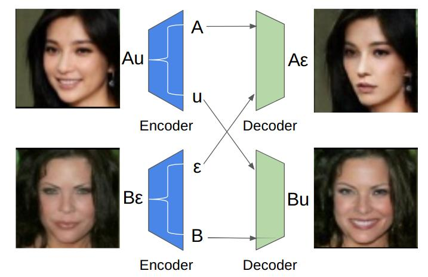
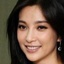
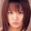
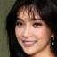
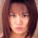
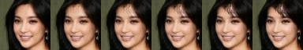
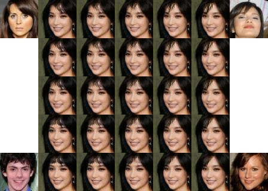

# GeneGAN: Learning Object Transfiguration and Attribute Subspace from Unpaired Data

By Shuchang Zhou, Taihong Xiao, Yi Yang, Dieqiao Feng, Qinyao He, Weiran He

If you use this code for your research, please cite our paper:
```
@inproceedings{DBLP:conf/bmvc/ZhouXYFHH17,
  author    = {Shuchang Zhou and
               Taihong Xiao and
               Yi Yang and
               Dieqiao Feng and
               Qinyao He and
               Weiran He},
  title     = {GeneGAN: Learning Object Transfiguration and Attribute Subspace from Unpaired Data},
  booktitle = {Proceedings of the British Machine Vision Conference (BMVC)},
  year      = {2017},
  url       = {http://arxiv.org/abs/1705.04932},
  timestamp = {http://dblp.uni-trier.de/rec/bib/journals/corr/ZhouXYFHH17},
  bibsource = {dblp computer science bibliography, http://dblp.org}
}
```

### Introduction

This is the official source code for the paper [GeneGAN: Learning Object Transfiguration 
and Attribute Subspace from Unpaired Data](https://arxiv.org/abs/1705.04932v1). All the experiments are initially done in 
our proprietary deep learning framework. For convenience, we reproduce the results using TensorFlow.

<div align="center">

</div> 
<br/>

GeneGAN is a deterministic conditional generative model that can learn to disentangle the object
features from other factors in feature space from weak supervised 0/1 labeling of training data.
It allows fine-grained control of generated images on a certain attribute in a continous way.

### Requirement

- Python 3.5
- TensorFlow 1.0
- Opencv 3.2


### Training GeneGAN on celebA dataset

0. Download [celebA](http://mmlab.ie.cuhk.edu.hk/projects/CelebA.html) dataset and unzip it into
`datasets` directory. There are various source providers for CelebA datasets. To ensure that the
size of downloaded images is correct, please run `identify datasets/celebA/data/000001.jpg`. The
size should be 409 x 687 if you are using the same dataset. Besides, please ensure that you have
the following directory tree structure.

```
├── datasets
│   └── celebA
│       ├── data
│       ├── list_attr_celeba.txt
│       └── list_landmarks_celeba.txt
```

1. Run `python preprocess.py`. It will take several miniutes to preprocess all face images.
A new directory `datasets/celebA/align_5p` will be created.

2. Run `python train.py -a Bangs -g 0` to train GeneGAN on the attribute `Bangs`. 
You can train GeneGAN on other attributes as well. All available attribute names are
listed in the `list_attr_celeba.txt` file. 

3. Run `tensorboard --logdir='./' --port 6006` to watch your training process.


### Testing

We provide three kinds of mode for test. Run `python test.py -h` for detailed help.
The following example is running on our GeneGAN model trained on the attribute
`Bangs`. Have fun!

#### 1. Swapping of Attributes 

You can easily add the bangs of one person to another person without bangs by running 

    python test.py -m swap -i datasets/celebA/align_5p/182929.jpg -t datasets/celebA/align_5p/022344.jpg

<div align="center">





</div>
<div align="center">
Swap Attribute
</div>
<br/>


#### 2. Linear Interpolation of Image Attributes

Besides, we can control to which extent the bangs style is added to your input image
through linear interpolation of image attribute. Run the following code.

    python test.py -m interpolation -i datasets/celebA/align_5p/182929.jpg -t datasets/celebA/align_5p/035460.jpg -n 5

<div align="center">

 
</div>
<div align="center">
Linear Interpolation
</div>
<br/>

#### 3. Matrix Interpolation in Attribute Subspace

We can do something cooler. Given four images with bangs attributes at hand,
we can observe the gradual change process of our input images with a mixing of
difference bangs style.

    python test.py -m matrix -i datasets/celebA/align_5p/182929.jpg --targets datasets/celebA/align_5p/035460.jpg datasets/celebA/align_5p/035451.jpg datasets/celebA/align_5p/035463.jpg datasets/celebA/align_5p/035474.jpg -s 5 5

<div align="center">

</div>
<div align="center">
Matrix Interpolation
</div>
<br/>

