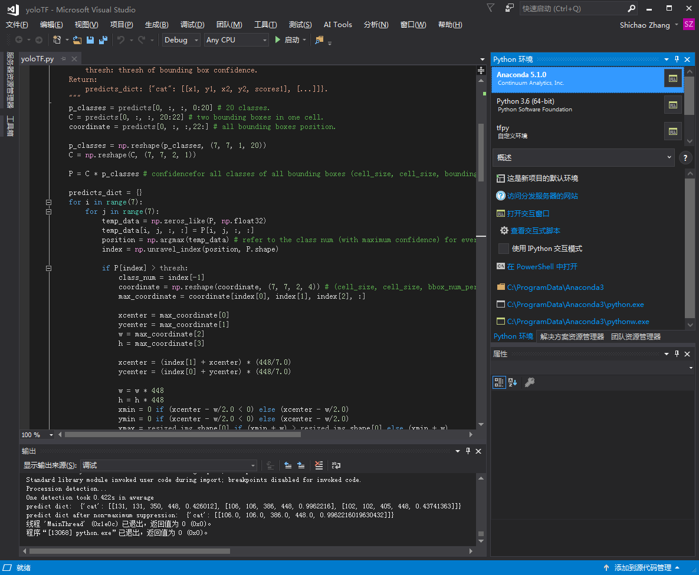

# How to use this YOLO model?

[简体中文](/zh-hans/examples/tensorflow/yoloTF/README.md)

> This project is designed to reproduce YOLO model. 


## Require 

- Python 3.5 
- Tensorflow 1.5 or higher
- Opencv 3.0 or higher
- Numpy
- A pre-trained model

&emsp;&emsp; https://drive.google.com/file/d/0B-yiAeTLLamRekxqVE01Yi1RRlk/view?usp=sharing


## Test Demo

### Test by Command Line

```shell
cd yoloTF
python yoloTF.py
```

### Test using VS2017

You need to install VS2017, and configure it with tensorflow, python and opencv.

Open yoloTF project, find yoloTF.py file, and click "Run" button.



## Train 

##### Download pascal-Voc2007 data

1. Download the training, validation and test data

   > For windows users, just copy the following 2 links into your favorite browser, press "Enter" to start downloading.

   ```
   wget http://host.robots.ox.ac.uk/pascal/VOC/voc2007/VOCtrainval_06-Nov-2007.tar
   wget http://host.robots.ox.ac.uk/pascal/VOC/voc2007/VOCtest_06-Nov-2007.tar

   ```

2. Extract all of these tars into one directory named `VOCdevkit`

   > For windows users, use Winrar to extract the compressed files.

   ```
   tar xvf VOCtrainval_06-Nov-2007.tar
   tar xvf VOCtest_06-Nov-2007.tar

   ```

3. It should have this basic structure

   ```
   $VOCdevkit/                           # development kit
   $VOCdevkit/VOCcode/                   # VOC utility code
   $VOCdevkit/VOC2007                    # image sets, annotations, etc.
   # ... and several other directories ...
   ```

4. Create symlinks for the PASCAL VOC dataset

   > For windows users, right click the VOCdevkit/ folder and select "create symbolic links", and copy this link to the "data" directory. Or you can directly copy the whole "VOCdevkit" folder into the "data" directory and rename it "VOCdevkit2007"

   ```
   cd $YOLO_ROOT/data
   ln -s $VOCdevkit VOCdevkit2007
   ```

   Using symlinks is a good idea because you will likely want to share the same PASCAL dataset installation between multiple projects.

#### convert the Pascal-voc data to text_record file

```
python tools/preprocess_pascal_voc.py
```

#### train

```
python tools/train.py -c conf/train.cfg
```

Or use VS2017 to run the code.

#### Train your customer data

1. transform your training data to text_record file(the format reference to pascal_voc)
2. write your own train-configure file
3. train (python tools/train.py -c $your_configure_file)

## License

MIT License （See [LICENSE.md](LICENSE.md)）