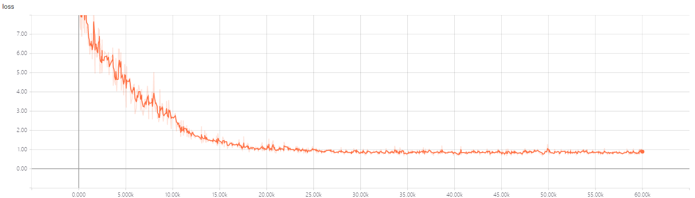
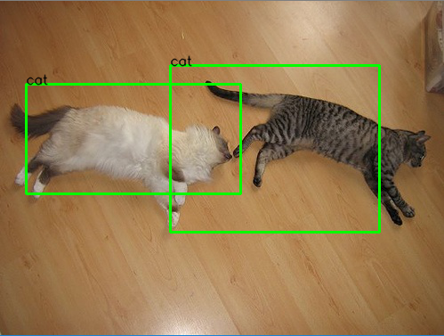
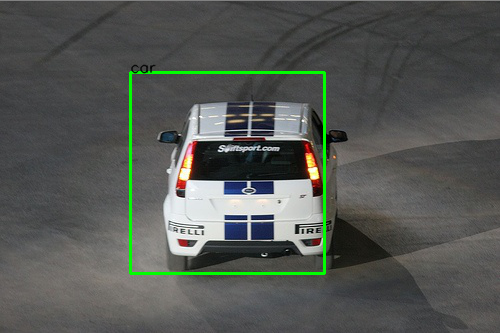

# Yolo_V1 Tensorflow

## Dependence

```
[sudo] pip install tensorflow-gpu opencv-python
```

## Download pascal-voc 2007 data

```
wget http://host.robots.ox.ac.uk/pascal/VOC/voc2007/VOCtrainval_06-Nov-2007.tar
tar xvf VOCtrainval_06-Nov-2007.tar
```

## Train

```
python train.py
```


## Test

```
python test.py
```

## Demo



