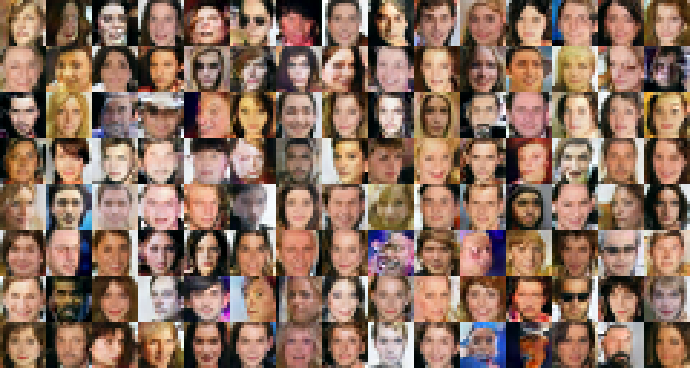
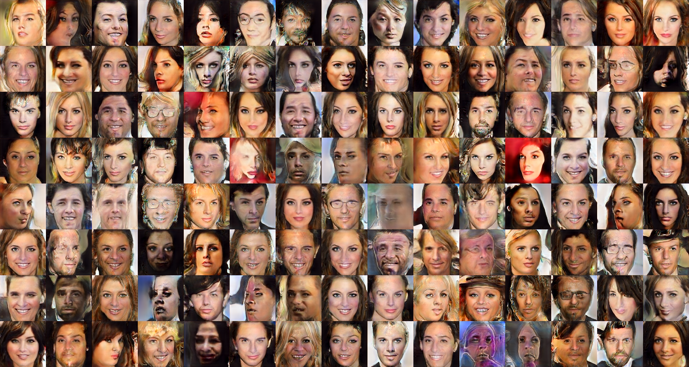

# Keras-progressive_growing_of_gans

[English](/examples/keras/Progressive%20growing%20of%20GANs/README.md)

## 介绍

这是Keras的持续增长生成对抗网络的一个实现，它在质量、稳定性和变化上有了不少改进。

由北航微软学生俱乐部开发。

主要开发人员：Kun Yan, Yihang Yin, Xutong Li。

开发人员：Jiaqi Wang, Junjie Wu

## 必需组件

1. Python3 
2. keras 2.1.2 (TensorFlow后端)
3. [CelebA数据集](http://mmlab.ie.cuhk.edu.hk/projects/CelebA.html)

## 如何运行

### 1. 克隆代码库

### 2. 准备数据集

首先下载[CelebA数据集](http://mmlab.ie.cuhk.edu.hk/projects/CelebA.html)。

运行**h5tool.py**来创建HDF5格式的数据集。 **h5tool.py**的默认设置将图片剪切为128*128大小，并创建一个通道后置(channel-last)的h5文件。

    $ python3 h5tool.py create_celeba_channel_last <h5 文件名> <CelebA 文件夹>
    

修改**config.py**文件可以自定义设置。

    # In config.py:
    data_dir = 'datasets'
    result_dir = 'results'
    
    dataset = dict(h5_path=<h5 文件名>, resolution=128, max_labels=0, mirror_augment=True)
    # 注意: "data_dir" 应该被改为你的h5文件的文件夹
    

当前只支持CelebA数据集，如果想要切换到其它数据集上，需要修改**dataset.py**和**h5tools.py**文件中的代码。

### 3. 开始训练！

    $ python3 train.py
    

在**train.py**中：

    # In train.py:
    speed_factor = 20
    # 如果不需要，可以设置为1。
    

"speed_factor"参数会加快算法的转换过程（切换分辨率），但会降低图片的清晰度。这个参数用于在我们开发过程中加快验证过程，但它也能让算法的速度变得更快。如果不需要此参数，可以将其设置为"1"。

**如果在设置上没遇到问题，那么就能看到像[running_log_example](running_log_example.txt)中一样的运行信息了。**

### 4. 保存并恢复训练权重

**train.py**文件中的参数会决定保存训练结果快照的频率。 如果想恢复某个以前的结果，只需要修改**train.py**文件：

    # 在 train.py 中：
    image_grid_type         = 'default',
    # 将下面行
    # resume_network          = None,
    # 修改为：
    resume_network          = <权重快照的目录>,
    resume_kimg             = <以前训练的图片（千为单位）>,
    

### 5. 使用main.py (可选)

**main.py**文件支持Visual Studio或Visual Studio Code用户的远程训练。 这样，可以直接从命令行或VS调试器直接启动它，这在远程提交命令时会很方便。

    $ python3 main.py   --data_dir = <数据集的h5文件目录>    \
                --resume_dir = <权重快照目录>     \
                --resume_kimg = <以前训练的图片（千为单位）>
    

## 结果

下面的两张图片是在NVIDIA GeForce 1080-ti显卡上训练了5天的结果。 能看到在我们的持续增长过程中分辨率的变化。 预训练的权重会随后提供。

## 联系我们

如果有任何bug或建议，请联系我们：

Kun Yan (naykun) : yankun1138283845@foxmail.com

Yihang Yin (Somedaywilldo) : somedaywilldo@foxmail.com

## 参考

1. *Progressive Growing of GANs for Improved Quality, Stability, and Variation*, **Tero Karras** (NVIDIA), **Timo Aila** (NVIDIA), **Samuli Laine** (NVIDIA), **Jaakko Lehtinen** (NVIDIA and Aalto University) [Paper (NVIDIA research)](http://research.nvidia.com/publication/2017-10_Progressive-Growing-of)

2. tkarras/progressive_growing_of_gans (https://github.com/tkarras/progressive_growing_of_gans

3. github-pengge/PyTorch-progressive_growing_of_gans (https://github.com/github-pengge/PyTorch-progressive_growing_of_gans)

## 许可证

代码遵循[MIT许可](https://en.wikipedia.org/wiki/MIT_License)。 参见<LICENSE>

## 给中文用户的礼物

我们将原始论文简要的翻译成了中文，提供了markdown的版本，希望这对中国用户有价值。