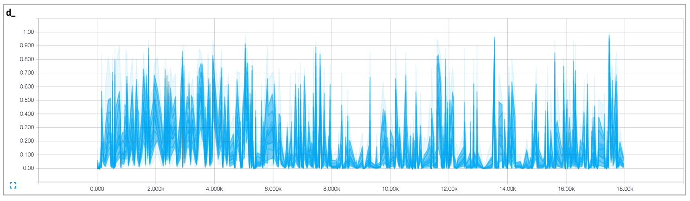

# Tensorflow中实现DCGAN

[简体中文](/zh-hans/examples/tensorflow/DCGAN/README.md)

Tensorflow implementation of [Deep Convolutional Generative Adversarial Networks](http://arxiv.org/abs/1511.06434) which is a stabilize Generative Adversarial Networks. The referenced torch code can be found [here](https://github.com/soumith/dcgan.torch).

- 基于这个代码库，[Brandon Amos](http://bamos.github.io/)写了非常好的[博客](http://bamos.github.io/2016/08/09/deep-completion/)和[图像完整的代码](https://github.com/bamos/dcgan-completion.tensorflow)。
- *与原始论文不同的是，为了避免D（判别）网络快速汇聚，在每次D网络更新时，G（生成）网络会更新两次。*

## 在线演示

[link](http://carpedm20.github.io/faces/)

## 先决条件

- Python 2.7或Python 3.3+
- [Tensorflow 0.12.1](https://github.com/tensorflow/tensorflow/tree/r0.12)
- [SciPy](http://www.scipy.org/install.html)
- [pillow](https://github.com/python-pillow/Pillow)
- (可选) [moviepy](https://github.com/Zulko/moviepy) (用于可视化)
- (可选) [Align&Cropped Images.zip](http://mmlab.ie.cuhk.edu.hk/projects/CelebA.html) : 大规模CelebFaces数据集

## 用法

First, download dataset with:

    $ python download.py mnist celebA
    

To train a model with downloaded dataset:

    $ python main.py --dataset mnist --input_height=28 --output_height=28 --train
    $ python main.py --dataset celebA --input_height=108 --train --crop
    

To test with an existing model:

    $ python main.py --dataset mnist --input_height=28 --output_height=28
    $ python main.py --dataset celebA --input_height=108 --crop
    

Or, you can use your own dataset (without central crop) by:

    $ mkdir data/DATASET_NAME
    ... add images to data/DATASET_NAME ...
    $ python main.py --dataset DATASET_NAME --train
    $ python main.py --dataset DATASET_NAME
    $ # example
    $ python main.py --dataset=eyes --input_fname_pattern="*_cropped.png" --train
    

If your dataset is located in a different root directory:

    $ python main.py --dataset DATASET_NAME --data_dir DATASET_ROOT_DIR --train
    $ python main.py --dataset DATASET_NAME --data_dir DATASET_ROOT_DIR
    $ # 样例
    $ python main.py --dataset=eyes --data_dir ../datasets/ --input_fname_pattern="*_cropped.png" --train
    

## 结果

### celebA

After 6th epoch:

After 10th epoch:

### 亚洲人脸数据集

### MNIST

MNIST codes are written by [@PhoenixDai](https://github.com/PhoenixDai).

More results can be found [here](./assets/) and [here](./web/img/).

## 训练详情

Details of the loss of Discriminator and Generator (with custom dataset not celebA).

Details of the histogram of true and fake result of discriminator (with custom dataset not celebA).

## 相关工作

- [BEGAN-tensorflow](https://github.com/carpedm20/BEGAN-tensorflow)
- [DiscoGAN-pytorch](https://github.com/carpedm20/DiscoGAN-pytorch)
- [simulated-unsupervised-tensorflow](https://github.com/carpedm20/simulated-unsupervised-tensorflow)

## 作者

Taehoon Kim / [@carpedm20](http://carpedm20.github.io/)

## 许可证

MIT License