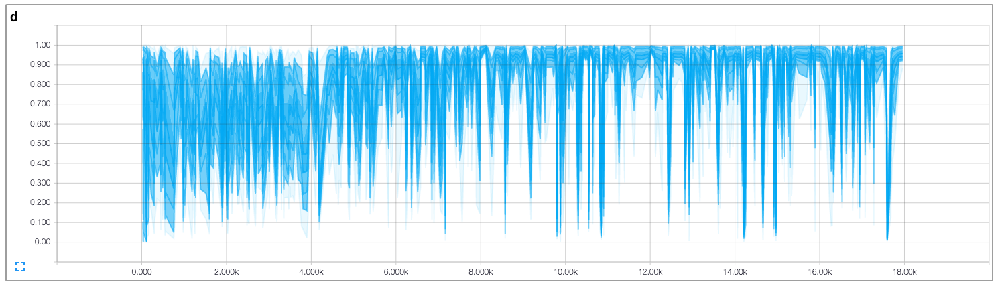

# Tensorflow中实现DCGAN

[English](/examples/tensorflow/DCGAN/README.md)

Tensorflow实现了[Deep Convolutional Generative Adversarial Networks](http://arxiv.org/abs/1511.06434)描述的稳定的生成对抗网络。 引用的torch代码[在这里](https://github.com/soumith/dcgan.torch)。

- 基于这个代码库，[Brandon Amos](http://bamos.github.io/)写了非常好的[博客](http://bamos.github.io/2016/08/09/deep-completion/)和[图像完整的代码](https://github.com/bamos/dcgan-completion.tensorflow)。
- *与原始论文不同的是，为了避免D（判别）网络快速汇聚，在每次D网络更新时，G（生成）网络会更新两次。*

## 在线演示

[链接](http://carpedm20.github.io/faces/)

## 先决条件

- Python 2.7或Python 3.3+
- [Tensorflow 0.12.1](https://github.com/tensorflow/tensorflow/tree/r0.12)
- [SciPy](http://www.scipy.org/install.html)
- [pillow](https://github.com/python-pillow/Pillow)
- (可选) [moviepy](https://github.com/Zulko/moviepy) (用于可视化)
- (可选) [Align&Cropped Images.zip](http://mmlab.ie.cuhk.edu.hk/projects/CelebA.html) : 大规模CelebFaces数据集

## 用法

首先，用下面的命令下载数据集：

    $ python download.py mnist celebA
    

用下载的数据集训练模型：

    $ python main.py --dataset mnist --input_height=28 --output_height=28 --train
    $ python main.py --dataset celebA --input_height=108 --train --crop
    

测试已有的模型：

    $ python main.py --dataset mnist --input_height=28 --output_height=28
    $ python main.py --dataset celebA --input_height=108 --crop
    

或者用自己的数据集（不带中心裁剪）：

    $ mkdir data/DATASET_NAME
    ... add images to data/DATASET_NAME ...
    $ python main.py --dataset DATASET_NAME --train
    $ python main.py --dataset DATASET_NAME
    $ # example
    $ python main.py --dataset=eyes --input_fname_pattern="*_cropped.png" --train
    

如果你的数据集在不同的根目录中：

    $ python main.py --dataset DATASET_NAME --data_dir DATASET_ROOT_DIR --train
    $ python main.py --dataset DATASET_NAME --data_dir DATASET_ROOT_DIR
    $ # 样例
    $ python main.py --dataset=eyes --data_dir ../datasets/ --input_fname_pattern="*_cropped.png" --train
    

## 结果

### celebA

6批次以后：

10批次以后：

### 亚洲人脸数据集

### MNIST

MNIST代码作者是[@PhoenixDai](https://github.com/PhoenixDai)。

可以在[这里](./assets/)和[这里](./web/img/)找到更多结果。

## 训练详情

判别器和生成器损失率的详细信息(基于自定义数据集，而非celebA)。

判别器真假结果的柱状图(基于自定义数据集，而非celebA)。

## 相关工作

- [BEGAN-tensorflow](https://github.com/carpedm20/BEGAN-tensorflow)
- [DiscoGAN-pytorch](https://github.com/carpedm20/DiscoGAN-pytorch)
- [simulated-unsupervised-tensorflow](https://github.com/carpedm20/simulated-unsupervised-tensorflow)

## 作者

Taehoon Kim / [@carpedm20](http://carpedm20.github.io/)

## 许可证

MIT许可证