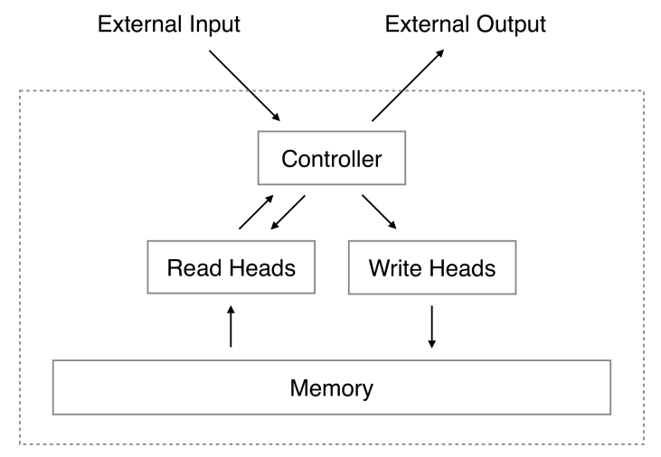
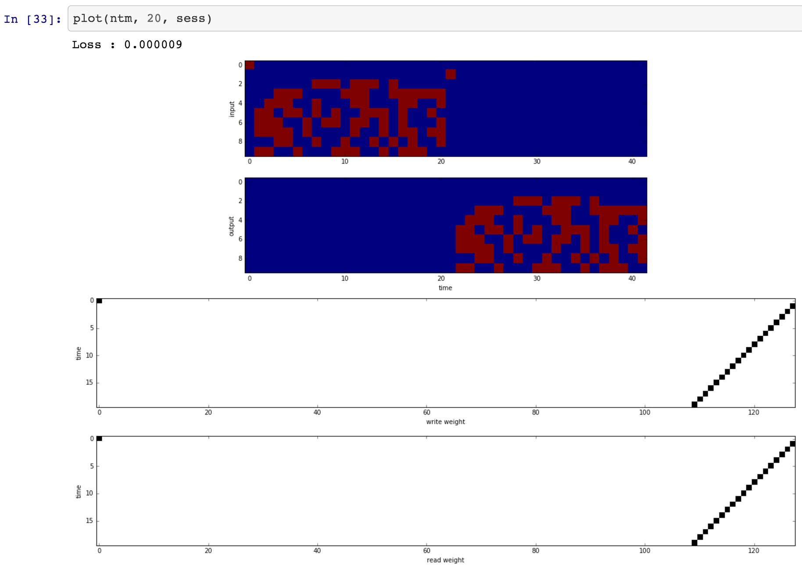
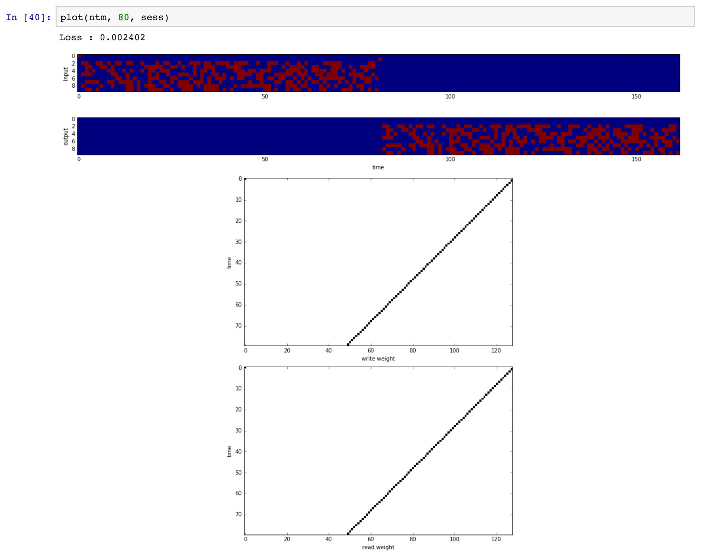

# Tensorflow中的神经图灵机

[English](/examples/tensorflow/NTM/README.md)

Tensorflow的[Neural Turing Machine](http://arxiv.org/abs/1410.5401)实现。 该实现用了LSTM控制器。 NTM模型支持多次读写头。

参考的torch代码可在[这里](https://github.com/kaishengtai/torch-ntm)找到。

** 1. 有时甚至在修剪了梯度值的情况下，也会出现非法值 ([#2](https://github.com/carpedm20/NTM-tensorflow/issues/2)).** ** 2. 代码对于变长的NTM输入支持很有限。 请仅将此代码作为参考。**

## 先决条件

- Python 2.7或Python 3.3+
- [Tensorflow 1.1.0](https://www.tensorflow.org/)
- NumPy

## 用法

训练复制的任务：

    $ python main.py --task copy --is_train True
    

测试*快速*复制任务：

    $ python main.py --task copy --test_max_length 10
    

## 结果

在[这里](ipynb/NTM\ Test.ipynb)有更多详细结果。

**复制任务：**

 

**召回任务：**

(正在进行中)

## 作者

Taehoon Kim / [@carpedm20](http://carpedm20.github.io/)

## 许可证

MIT许可证