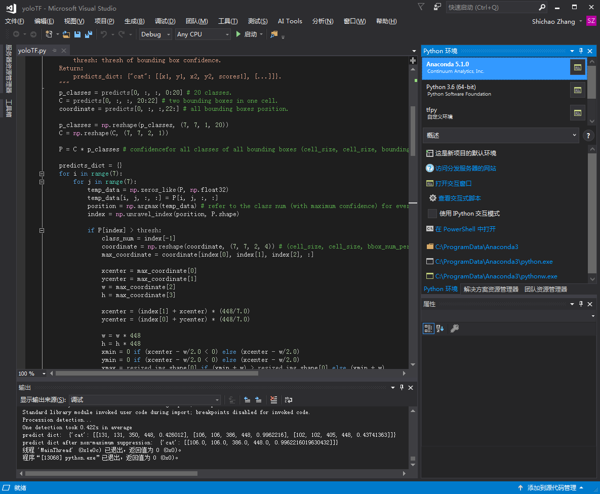

# 如何使用YOLO模型？

[English](/examples/tensorflow/yoloTF/README.md)

> 此项目用于重现YOLO模型。

## 必需组件

- Python 3.5 
- Tensorflow 1.5或更高版本
- Opencv 3.0或更高版本
- Numpy
- 预训练模型

&emsp;&emsp; https://drive.google.com/file/d/0B-yiAeTLLamRekxqVE01Yi1RRlk/view?usp=sharing

## 测试演示

### 通过命令行测试

```shell
cd yoloTF
python yoloTF.py
```

### 通过VS2017测试

需要安装VS2017，并配置集成tensorflow, python和OpenCV。

打开yoloTF项目，找到yoloTF.py文件，并点击"运行"按钮。



## 训练

##### 下载pascal-Voc2007数据

1. 下载训练、验证和测试数据
    
    > 对于windows用户，只需要将下面的两个链接复制到浏览器里，按"回车"开始下载。
    
        wget http://host.robots.ox.ac.uk/pascal/VOC/voc2007/VOCtrainval_06-Nov-2007.tar
        wget http://host.robots.ox.ac.uk/pascal/VOC/voc2007/VOCtest_06-Nov-2007.tar
        
        

2. 将所有tar文件抽取到`VOCdevkit`文件夹中
    
    > Windows用户可以使用WinRAR来抽取压缩文件。
    
        tar xvf VOCtrainval_06-Nov-2007.tar
        tar xvf VOCtest_06-Nov-2007.tar
        
        

3. 文件夹的基本结构如下
    
        $VOCdevkit/                           # 开发工具包
        $VOCdevkit/VOCcode/                   # VOC工具代码
        $VOCdevkit/VOC2007                    # 图片集、标注等
        # ... 其它目录...
        

4. 为PASCAL VOC数据集创建符号链接
    
    > Windows用户可通过命令行创建相应的符号链接，并复制到"data"文件夹中。 或者可以将整个"VOCdevkit"文件夹复制到"data"目录中，并改名为"VOCdevkit2007"。
    
        cd $YOLO_ROOT/data
        ln -s $VOCdevkit VOCdevkit2007
        
    
    使用符号链接能够将同一份PASCAL数据集共享给多个项目，从而节省空间。

#### 将Pascal-voc数据转换为text_record文件

    python tools/preprocess_pascal_voc.py
    

#### 训练

    python tools/train.py -c conf/train.cfg
    

或用VS2017来运行代码。

#### 在自己的数据上训练

1. 将训练数据转换为text_record文件 (参考pascal_voc的格式)
2. 创建自定义的train-configure文件
3. 训练 (python tools/train.py -c $your_configure_file)

## 许可证

MIT许可证（参阅<LICENSE.md>）